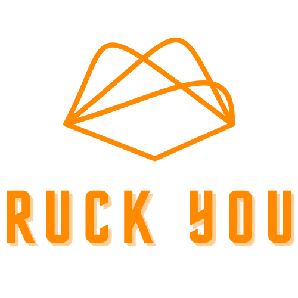

Are you ready to take your fitness to the next level? Rucking is a fantastic way to build strength, improve endurance, and explore the great outdoors. Whether you're a seasoned hiker or just starting out, Ruck You is a new commmunity ready to support.

---

## What is Rucking?

Rucking is simply walking with a weighted backpack. It's a versatile, scalable workout that combines cardio and strength training. Perfect for all fitness levels, rucking helps burn calories, improve posture, and build muscle. Plus, it's a great way to enjoy the UK's beautiful landscapes.

---

## Getting Started

Starting with rucking is easy! Here are the basics:

1. **Choose the Right Gear**: You'll need a sturdy backpack (ruck) and weights. Start with a weight that feels challenging but manageable.
2. **Find Your Route**: Explore local parks, trails, or even urban areas. The UK has a wealth of beautiful rucking routes.
3. **Set Your Pace**: Begin with short distances and gradually increase your weight and distance as your fitness improves.
4. **Join a Community**: Connect with fellow ruckers in your area. Joining a group can make rucking more enjoyable and keep you motivated.

---

## Essential Gear

- **Backpacks**: Look for durable, comfortable options with padded straps.
- **Weights**: Use weight plates, sandbags, or even water bottles to add resistance.
- **Footwear**: Invest in good quality hiking boots or sturdy trainers.
- **Clothing**: Dress in layers and choose moisture-wicking fabrics.

---

## Top Rucking Spots in the UK

- **Lake District**: Stunning scenery and challenging trails.
- **Peak District**: Diverse landscapes and picturesque routes.
- **Snowdonia**: For those seeking a real challenge with breathtaking views.

---

## Join the Ruck You Community

At Ruck You, we're building a community of like-minded individuals who are interested in rucking. Join us on social media for tips, motivation, and to share your rucking adventures. Follow us on:

- **[Instagram](https://www.instagram.com/ruckyou_uk)**: @ruckyou_uk

---

## About Me

Hi, I'm Rob, the founder of Ruck You. Rucking isn't new, but it's new to me. As someone who is just starting out with this form of exercise, I want to explore the benefits for both physical and mental health. My goal with Ruck You is to inspire others to join me on this journey, improve their fitness, and enjoy the beauty of the UK's outdoors.

I created Ruck You to share my experiences, tips, and to build a supportive community of ruckers. Whether you're a beginner like me or an experienced rucker, I hope this platform helps you find the motivation, tips, and companionship you need to succeed. Let's walk, ruck, and explore together!

---

**Walk. Ruck. Explore.**
